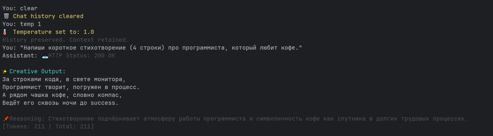
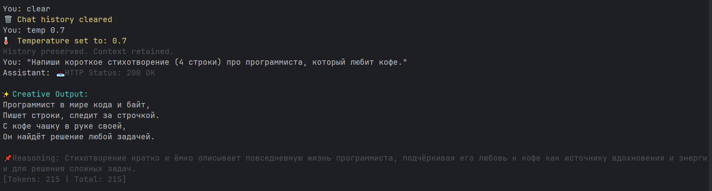
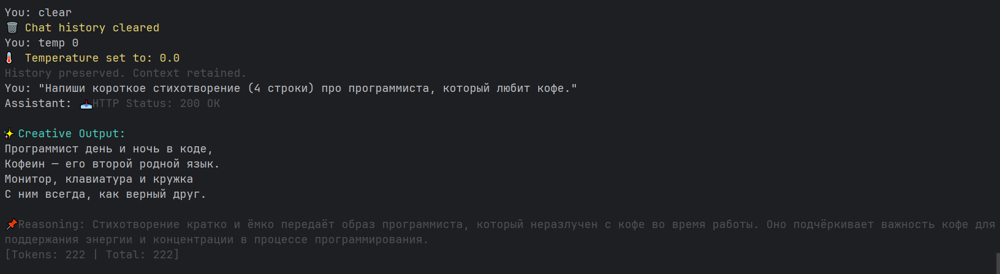

# 🌡️ Отчет по эксперименту: Влияние температуры (Temperature)

**Цель:** Исследовать, как параметр `temperature` влияет на качество, креативность и вариативность ответов Yandex GPT.

**Тестовые сценарии:**
1. Написание стихотворения (проверка рифмы и идиом).
2. Ответ на простой вопрос "Как прошел день?" (проверка метафор).

---

## 🎬 Практический эксперимент: Скриншоты из консоли

### Запрос: "Напиши короткое стихотворение (4 строки) про программиста, который любит кофе."

#### Температура 1.0 (Креатив)

✨ **Инсайт:** Использование английского слова `success` для рифмы с `процесс` — это нестандартное решение, которое делает текст живым и современным. Это возможно только при высокой температуре.

---

#### Температура 0.7 (Баланс)

📌 **Инсайт:** Модель пытается рифмовать, но возникают грамматические шероховатости ("любой задачей" вместо "любой задачей"). Текст более живой, чем при Temp 0.0, но менее креативный, чем при Temp 1.0.

---

#### Температура 0.0 (Детерминизм)

🤖 **Инсайт:** Максимально формально и шаблонно. "Второй родной язык" — это банальное выражение. Отсутствуют нетривиальные рифмы или образы.

---

## 📊 Сводная таблица результатов

| Temp | Характеристика стиля | Примеры из тестов | Оценка роли |
|------|----------------------|-------------------|-------------|
| **0.0** | **Детерминированный, сухой.** Ответы шаблонные, похожи на канцелярит или машинный перевод. Метафоры самые банальные. | *"С чашкой кофе — его сила."* *"День полон идей, как палитра красками."* | 🤖 Секретарь / Робот |
| **0.7** | **Сбалансированный.** Появляется естественность, попытки рифмовать. Стандартный режим для чат-ботов. | *"Работа не та, а лишь половина."* *"День полон удивительных моментов."* | 😐 Собеседник |
| **1.0** | **Креативный, литературный.** Неожиданные ассоциации, использование идиом, англицизмов, сложных образов. | *"Ведёт его сквозь ночи до **success**."* *"Мазки впечатлений и оттенки эмоций."* | 🎨 Поэт / Копирайтер |

---

## 🔍 Ключевые инсайты

### 1. Температура влияет на глубину ассоциаций
При `Temp 0.0` модель выбирает самую очевидную связь ("День -> Палитра"). При `Temp 1.0` она находит более сложные, художественные связи ("День -> Холст -> Мазки впечатлений").

### 2. Креативность vs Грамматика
Повышение температуры улучшает образность, но может ухудшать грамматическую согласованность (падежи) или ломать жесткие форматы вывода (JSON).

### 3. Феномен "Success"
При высокой температуре модель способна на нестандартные ходы, например, рифмовать русское слово с английским ("процесс" — "success"), что делает текст живым и современным.

---

## 💡 Рекомендации по использованию

*   **Temp 0.0 - 0.3:** Для задач, требующих точности и строгого формата (генерация JSON, SQL, извлечение данных).
    - Пример: Анализ текста, структурированные ответы.

*   **Temp 0.4 - 0.8:** Для повседневного общения, ответов на вопросы, суммаризации текстов.
    - Пример: Чат-боты, обучающие ассистенты.

*   **Temp 0.9 - 1.0:** Для творческих задач: нейминг, написание слоганов, стихов, сценариев, где важна оригинальность.
    - Пример: Маркетинг-контент, копирайтинг, брейншторм.

---

## 🎯 Выводы

**Для Yandex GPT (как и для других LLM):**
- Температура — это мощный инструмент управления поведением модели.
- Низкие значения обеспечивают надежность и воспроизводимость.
- Высокие значения открывают творческий потенциал, но требуют осторожности с форматом выходных данных.
- Оптимальное значение для большинства задач: **0.7 - 0.8**.